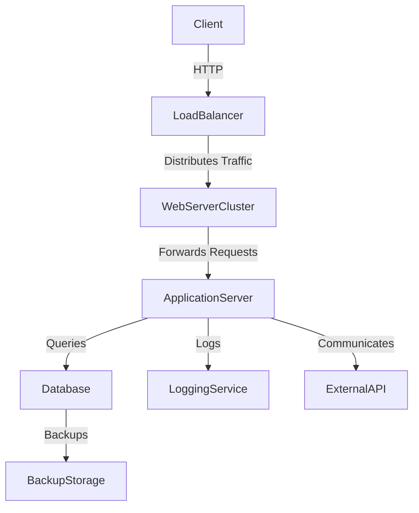

# Architecture Overview

This diagram provides an overview of the system architecture.

## Components

1. **Client**: The end-users who interact with the application.
2. **LoadBalancer**: Distributes incoming HTTP requests across the web server cluster.
3. **WebServerCluster**: A group of web servers handling client requests and forwarding them to the application server.
4. **ApplicationServer**: The core application server that processes business logic.
5. **Database**: Stores persistent data for the application.
6. **LoggingService**: Captures and stores logs for monitoring and debugging.
7. **BackupStorage**: Stores backups of the database data.
8. **ExternalAPI**: Third-party services that the application interacts with.
